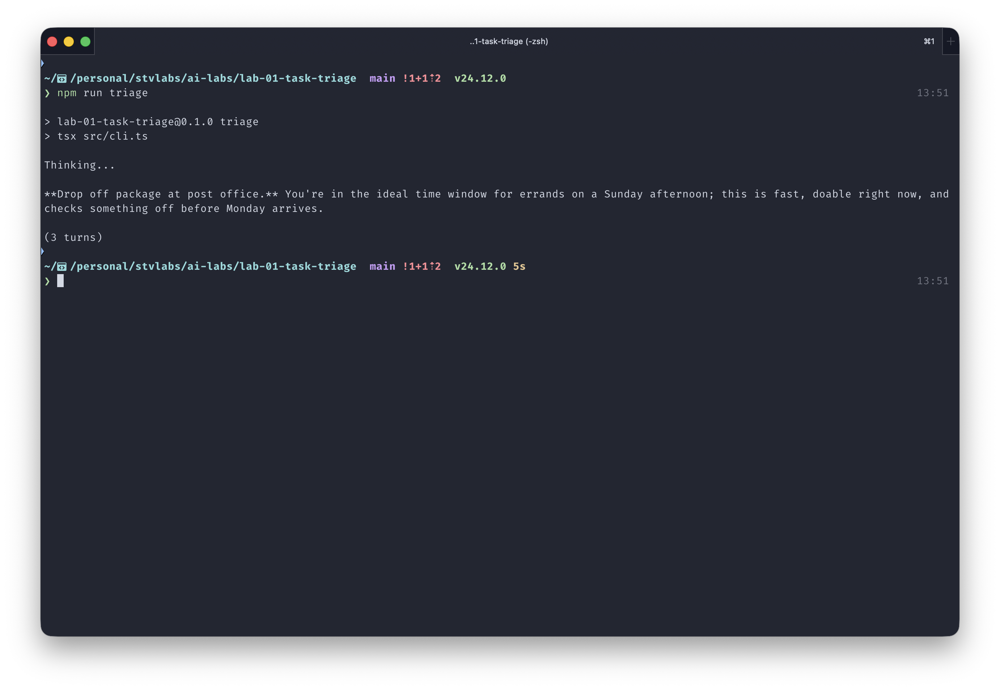

# Lab 1 — Task Triage CLI Agent

A CLI agent that reads your task list, checks the current day/time, and suggests one concrete first-step to do right now.

**Learning goal:** the Anthropic SDK `tool_use → tool_result → loop` cycle.

## Demo



## How it works

1. Call `get_current_focus` → current date + weekday + local time.
2. Call `read_tasks` → full markdown of the tasks file.
3. Call `suggest_next(task, reasoning)` → appends a JSONL line to `triage-log.jsonl`.
4. Respond in plain text with the recommendation.

System prompt + tool definitions are cached (`cache_control: ephemeral`) so tool-use rounds within a single run don't re-bill the schemas.

## Run

```bash
cp .env.example .env          # fill in ANTHROPIC_API_KEY
cp tasks.example.md tasks.md  # then edit tasks.md with your real tasks
npm install
npm run triage
```

`tasks.md` is gitignored — your tasks stay local. Set `TASKS_PATH` in `.env` if you'd rather point at a file elsewhere.

## Test

```bash
npm test          # vitest
npm run typecheck # tsc --noEmit
```

## Stack

TypeScript · Node 22 · `@anthropic-ai/sdk` · `claude-haiku-4-5-20251001` · Vitest

## What I learned

See [LOG.md](../LOG.md) — Lab 1 entry.
